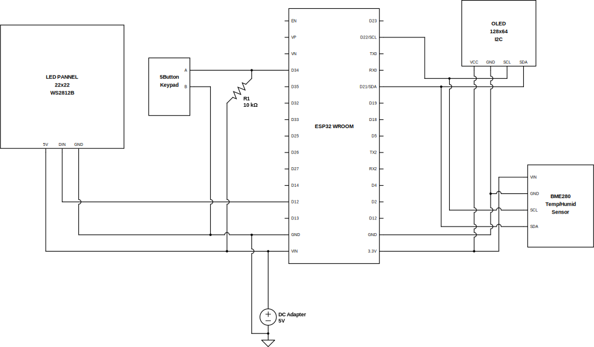

# ProtoPuck32

Multi-purpose prototype box based on ESP32

## Issues

LittleFS_esp32 library installed by PlatformIO seems broken, complaining about 

```
error: unknown field 'utime_p' specified in initializer
```
Replacing `libdeps/LittleFS_esp32` with downliad from [LittleFS_esp32](https://www.arduinolibraries.info/libraries/little-fs_esp32) fixes it

## Bill of materials (BOM)

* [ESP32 Wroom](https://www.amazon.com/gp/product/B08D5ZD528)
* [OLED 128x64 i2c](https://www.amazon.com/gp/product/B072Q2X2LL)
* [BME280 Temperature/Humidity sendor i2c](https://www.amazon.com/gp/product/B07KYJNFMD)
* [FPV Camera keypad](https://www.amazon.com/RunCam-Key-Board-FPV-Camera/dp/B0874GPT4W) - I used a joystick style from Caddx, but any would work, case will need adjustment
* [DC plug connector](https://www.amazon.com/gp/product/B01N8VV78D)
* [5V 15A power adapter](https://www.amazon.com/gp/product/B08764XJ2M)
* [White PLA for case and LED diffusion](https://www.amazon.com/gp/product/B01EKEMIIS)

---

## Builds

### LED Matrix


Add to BOM: [22x22 WS2812B pannel](https://www.amazon.com/gp/product/B075T9RRPM)

Schematic:



Case - 3D printed, STL files:

* [LED diffuser](case/LED_Matrix/LEDMatrix-Diffuser.stl)
* [LED frame](case/LED_Matrix/LEDMatrix-FrameSide.stl)
* [LED frame back brace](case/LED_Matrix/LEDMatrix-FrameBackBrace.stl)
* [Base](case/LED_Matrix/LEDMatrix-FrameBase.stl)
* [Base lid](case/LED_Matrix/LEDMatrix-FrameBaseLid.stl)

---

# Bugs / TODO

1. Connecting to Wifi AP after creating one fails - probably something needs to be cleaned up in the WiFi instances
1. Configuration menu
1. Remote controlled pixels via WiFi (HTTP Post or MQTT)
1. Report sensors data and config out to HTTP or MQTT
1. Remote control of config like brightness, mode, etc.